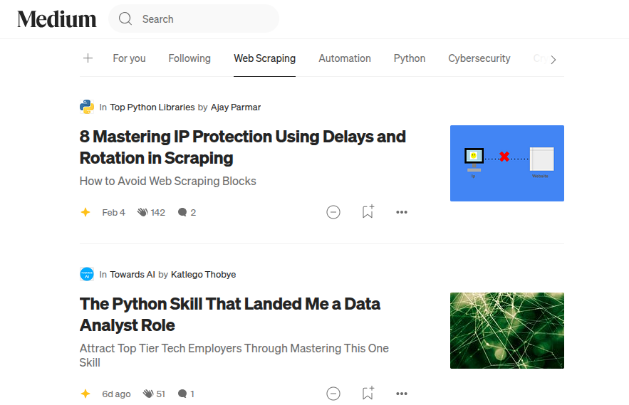
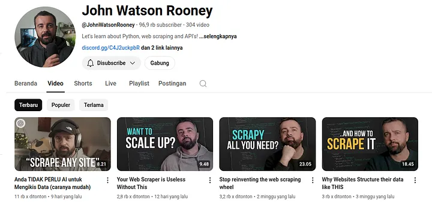
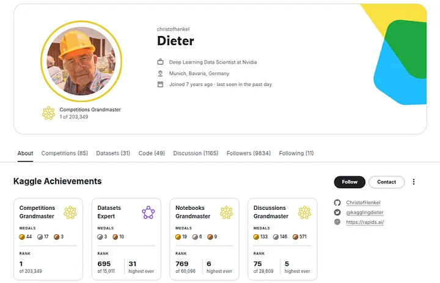
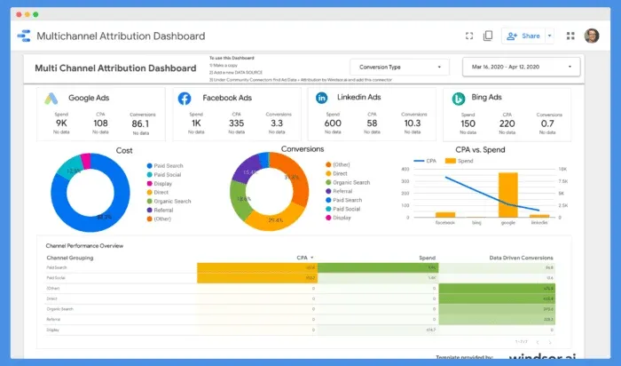
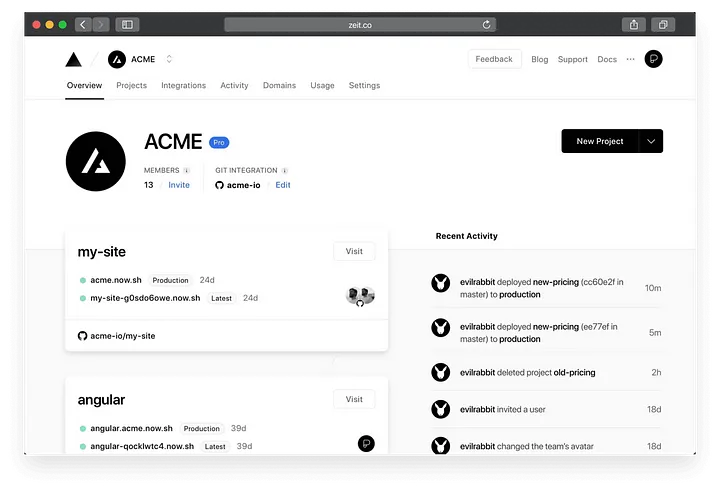

<!-- _color: White-->
<!-- _paginate: skip -->
<br>
<br>
<br>
<br>

# Building Project Portfolio
Python Web Scraping
<!-- <br> -->
<br>
<br>
<br>

Rianaditro | 2024

---
<!-- paginate: true -->
## Introduction
A portfolio is a curated collection of work that showcases your skills, experience, and achievements. It provides proof of your abilities through real-world projects, case studies, or examples.


```What is the difference between a portfolio and a resume?```

---

## Common Mistakes
Common portfolio mistakes:
❌ No explanation
❌ No measurable outcome
❌ Poor presentation
❌ No storytelling

---

## STAR Method
The STAR method helps you turn your projects into compelling case studies. Here’s how you can use it:
**Situation** — Describe the problem you tackled.
**Task** — Explain your role and responsibilities.
**Action** — Detail the steps you took to solve the problem.
**Result** — Highlight the outcome with measurable impact.

---

**Example**
An e-commerce company was struggling to track competitor prices effectively. Their existing scraping system was slow, often failing to capture real-time updates. This created pricing blind spots, leading to missed revenue opportunities.

Recognizing the urgency of the issue, I stepped in as a data engineer to improve the scraping speed and accuracy. My primary responsibility was to refine the system so that the company could make timely and informed pricing decisions.

---

After assessing the problem, I restructured the scraping scripts by implementing asynchronous requests. I also transitioned from Selenium to Scrapy, significantly optimizing performance. These changes reduced execution time by 70%, ensuring the data pipeline could handle real-time updates efficiently.

As a result, the company could monitor price changes dynamically, adjusting their pricing strategy on the fly. This led to a 15% increase in competitive pricing adjustments and a 5% boost in overall revenue, demonstrating the tangible impact of the optimization.

---
**Rewriting your project description**
Situation:
❌ Bad Example: “I worked on sentiment analysis.”
✅ Good Example: “Facing rising negative sentiment around a major brand on social media, our client needed a real-time tool to analyze public opinion and adjust their marketing strategy.”

Task:
❌ Bad Example: “I had to analyze the data.”
✅ Good Example: “I was tasked with building an end-to-end sentiment analysis pipeline to process large-scale social media data and deliver actionable insights within minutes.”

---
Action:
❌ Bad Example: “I used some libraries to analyze tweets.”
✅ Good Example: “I developed the pipeline using Python, integrating Tweepy for data extraction, NLTK for sentiment analysis, and visualized the results using an interactive Tableau dashboard. I also worked closely with the marketing team to fine-tune the analysis criteria.”

Result:
❌ Bad Example: “The project was successful.”
✅ Good Example: “The solution reduced analysis time by 80% and provided insights that improved the brand’s sentiment score by 10% within two months.”

---
## Class Activity
Write down your last activity. Then, use the STAR method to transform it into a well-structured achievement.

---
## Best Platforms and Formats for Your Portfolio
1. **Article - Medium**
Best for explaining scraping methodologies, challenges, and case studies.


---
2. **Videos - Youtube/Loom**
Perfect for walkthroughs of web scraping pipelines, API integrations, or automation workflows.


---
3. **Notebook - Kaggle**
Use notebooks to document your scraping logic, exploratory data analysis, and preprocessing steps in a structured format.


---
4. **Data Visualizations - Looker/Streamlit**
Useful for transforming raw scraped data into an interactive dashboard for easy interpretation.


---
5. **Live Website - Vercel, Pythonanywhere**
Great for dynamic scraping projects where users can input queries and get real-time data. 


---
## Tips for Improving Your Portfolio
1. Follow Trends
2. Grow Over time
3. Leverage Multiple Platforms
4. Focus on Quality, Not Just Quantity
5. Engage with the Community

---
## Reflection
Understand your audience and determine which platform works best for them.

---
## Exploration
Explore another storytelling framework that suits you.

---
<!-- _backgroundColor: grey -->
<!-- _color: white -->
<!-- _paginate: false -->
<br>
<br>
<br>
<br>

# Thank you
Any Question?
<!-- <br> -->
<br>
<br>
<br>

Kampus Remote Worker Indonesia | 2024

